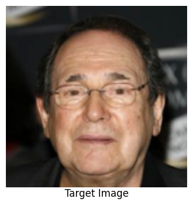
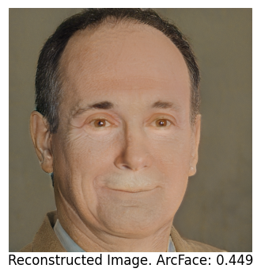

# Model Inversion Attack on FaceNet

**Authors:** Asaf Solomiak, Itay Gross

## Overview
This repository contains the code and findings for our lab project investigating the vulnerability of facial recognition models to **Model Inversion Attacks**. 

Google's FaceNet encodes facial images into low-dimensional embedding vectors, which are widely assumed to be irreversible. In this project, we demonstrate that these embeddings are vulnerable. By leveraging a generative prior via **StyleGAN** and employing a coarse-to-fine latent optimization strategy (from $W$ to $W+$ space), we successfully reconstruct highly recognizable faces solely from their FaceNet embeddings, achieving a 72% success rate on our CelebA-HQ test subset.

  

## Full Report
For an in-depth analysis of our methodology, loss functions, evaluation metrics, and discussion on adversarial overfitting, please read our **[Full Lab Report](docs/Lab_Final_Report.pdf)**.

## How to Run the Attack

The attack is designed to be executed in Google Colab using our main notebook. 

1. **Open the Notebook:** Open the `model_inversion_attack.ipynb` file located in the project's main folder, using Google Colab.
2. **Installations:** Run the first 4 installation cells. These would download the required models and packages. After these 4 cells, you would be prompted with a request to restart the session -> click on restart.
3. **Define Functions:** After restarting, start running the import section, and then all the function definitions. These include models, display function, metric functions, loading of data, and the main attack function.
4. **Choose Target:** In the following cell, select your target image by specifying its file path. For example the target that is loaded by default in the notebook is the third image of the dataset (index 00002).
5. **Run Attack:** Then, run the attack function passing the target embedding, target image, and any other hyperparameters that you want (seed, iteration amounts).
6. **View Results:** Run the final cell to process the reconstruction output, and display it together with the target image.
